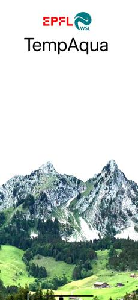
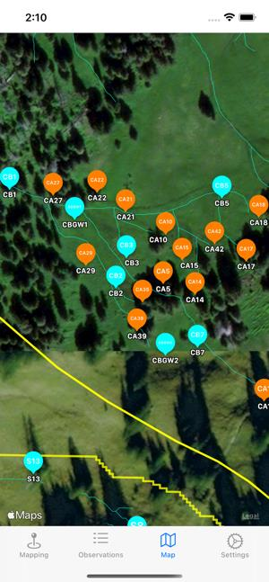
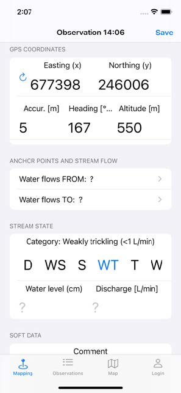
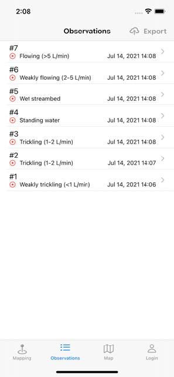
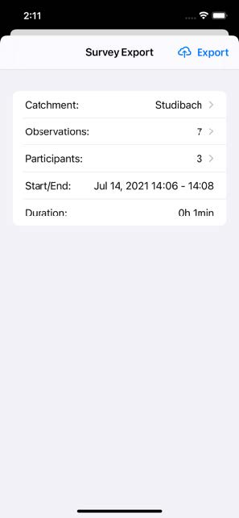

# TempAqua App for iOS
This mobile phone application facilitates mapping of intermittent streams. It is designed to make field work more efficient and less error-prone.

You collect the data in the field and then export it directly to the database. The application helps you navigating among mark-points, record the stream-related data, including photos and videos. The application is configurable; You import mark-points, stream network, and catchment shapes from geo-json files. 

The mapping mechanics is fairly simple. You navigate to interested mark-points based on your current location and imported catchment definition. You enter in the app the the data collected in these locations, like current stream state, discharge, comment, photos, or even movies of the flowing stream. After all, you click a button to simply export the survey to the database.

If you want to use the application in your project, please contact me. I offer access to a web-based portal that enables additional features, such as import/export of surveys, multiple users access, persistent database storage, access to historical stream mappings, and more.

# AppStore
The application is available for free on AppStore: 
https://apps.apple.com/uy/app/tempaqua/id1576484945

# Author
This application was developed by Izabela Bujak-Ozga.

# Licence
This work is licensed under CC BY-NC 4.0. Please check the LICENSE file for more details.

# Screenshots 

